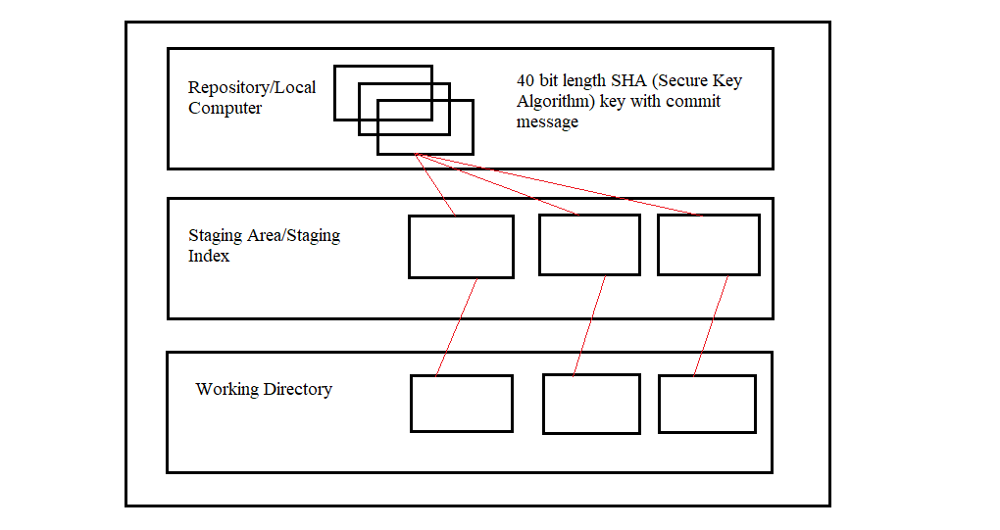

# APSSDC-GIT CLASSES

## Git is a distributed Control System

### This repository is created as a part of TOT.

###### Smallest Heading

*Italic Text*

_Star can be replace with underscore_

**Bold Text**

***Bold and Italic***

~Strike through Text~

## Unordered Lists
* Mango
  * Variety 1
  * Variety 2
* Grapes
* Apple


## Image Here



# Links
[Git official link](https://git-scm.com)

# BlockQuotes
> Blockquote Representation

# Syntax Highlighting
``` python
def isEven(num):
  if(num%2 == 0):
    return True
  return False
```

# Tasks
which of the following is not a keyword of python ?
- [ ] Yield
- [ ] Except
- [ ] Local
- [x] None

# Table 
Name | Team
-----|------
Ambika | Python
Archana | Python

# Emojiis
:rofl:
